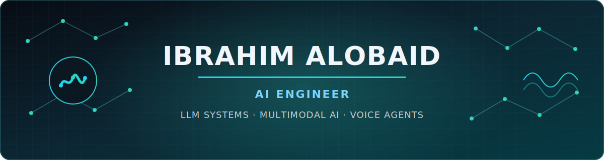
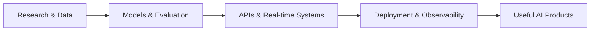
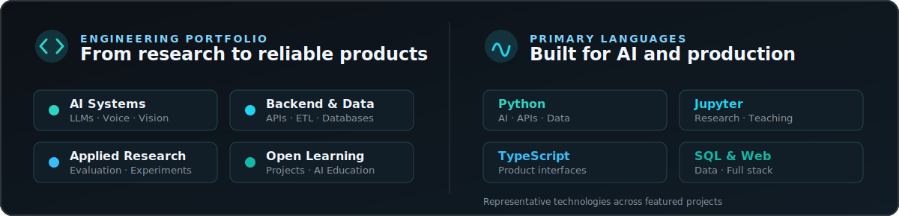

## About me

I am an **AI Engineer at Amani AI** and an **AI master's researcher at Aleppo University**, focused on building production-minded intelligent systems—not isolated model demos.

My work sits at the intersection of **real-time Voice AI, LLM-powered automation, multimodal systems, Computer Vision, and reliable data pipelines**. I enjoy taking an idea from research and evaluation through backend integration, deployment, observability, and real-world iteration.

- Building low-latency, multilingual voice agents with **WebRTC, Pipecat, STT, LLMs, and TTS**
- Engineering **RAG, agentic workflows, tool use, and structured LLM pipelines**
- Developing applied **Computer Vision and multimodal AI** systems
- Designing production APIs and data platforms with **FastAPI, PostgreSQL, Docker, and cloud services**
- Teaching practical AI and helping grow the developer community in Aleppo

> **Current principle:** A useful AI system is measured by reliability, latency, evaluation quality, and user impact—not only model accuracy.

## Featured work

<table>
<tr>
<td width="50%" valign="top">

### [AI Camp — University of Aleppo](https://github.com/IbrahimAlobaid/AI-Camp)

A practical six-session AI program covering **Machine Learning, Deep Learning, Computer Vision, NLP, LLM systems, and Voice Agents**, with notebooks and end-to-end projects.

`Education` `PyTorch` `Transformers` `RAG` `Pipecat`

</td>
<td width="50%" valign="top">

### [LaTeX OCR with Qwen 3.5](https://github.com/IbrahimAlobaid/LaTeX-OCR-with-Qwen-3.5)

A local multimodal application that converts equation images into clean, renderable LaTeX using **Qwen vision capabilities, Ollama, and Streamlit**.

`Multimodal AI` `OCR` `Qwen` `Ollama` `Streamlit`

</td>
</tr>
<tr>
<td width="50%" valign="top">

### [Martyrs Archive](https://github.com/IbrahimAlobaid/archive-of-martyrs)

An Arabic-first memorial platform with a production-oriented architecture: **Next.js, FastAPI, PostgreSQL, JWT, Cloudinary, tests, and Docker**.

`FastAPI` `Next.js` `PostgreSQL` `Docker` `RTL`

</td>
<td width="50%" valign="top">

### [Humanitarian Data Pipeline](https://github.com/IbrahimAlobaid/Ambulance-Operations-in-Northwest-Syria-Dataset-Pipeline)

An automated pipeline that collects, cleans, enriches, and merges HDX ambulance-operation data from Northwest Syria into an analysis-ready dataset.

`Python` `Pandas` `ETL` `HDX API` `Humanitarian Data`

</td>
</tr>
</table>

## What I build

| Focus | What it means in my work |
|---|---|
| **Voice & Conversational AI** | Streaming audio, multilingual STT/TTS, turn-taking, WebRTC, Pipecat, latency evaluation |
| **LLM Engineering** | RAG, tool calling, agent graphs, structured outputs, evaluation, local and hosted models |
| **Computer Vision** | Depth estimation, liveness detection, OCR, multimodal reasoning, 3D reconstruction research |
| **AI Backend Systems** | FastAPI services, async workflows, queues, PostgreSQL, Docker, testing, operational documentation |
| **Data Engineering** | Collection pipelines, normalization, validation, provenance, large-scale AML and public-data ingestion |

## Technology stack

### AI, ML & data

### Backend, infrastructure & product

**Also working with:** LangChain · LangGraph · Hugging Face · Pipecat · WebRTC · Ollama · OpenAI APIs · SQLAlchemy · Alembic · Celery · Elasticsearch · Streamlit · NumPy · Pandas

## Current research and engineering interests

- **Real-time Voice AI:** natural turn-taking, low-latency inference, multilingual systems, and self-hosted speech models
- **Modern LLM systems:** architecture, efficient adaptation, RAG, agents, evaluation, and production reliability
- **Multimodal intelligence:** vision-language models, depth estimation, spatial understanding, and human-centered interfaces
- **AI for meaningful problems:** education, accessibility, humanitarian data, healthcare workflows, and community tools

## GitHub & Kaggle

On Kaggle, I am a **Notebooks Expert**, sharing practical Data Science and Machine Learning work.

## Community & teaching

I believe technical depth becomes more valuable when it is shared clearly. Alongside engineering, I create practical AI learning experiences and support developer communities in Aleppo.

- AI educator and workshop facilitator at the **University of Aleppo**
- Builder of a hands-on AI curriculum spanning ML, DL, CV, NLP, LLMs, and Voice AI
- Founder and community builder at **Aleppo Dev Community**
- Contributor to Arabic technical education through workshops, projects, and learning resources

## Let's connect

I am interested in collaborations around **LLM systems, Voice AI, multimodal applications, Computer Vision research, and AI education**.

